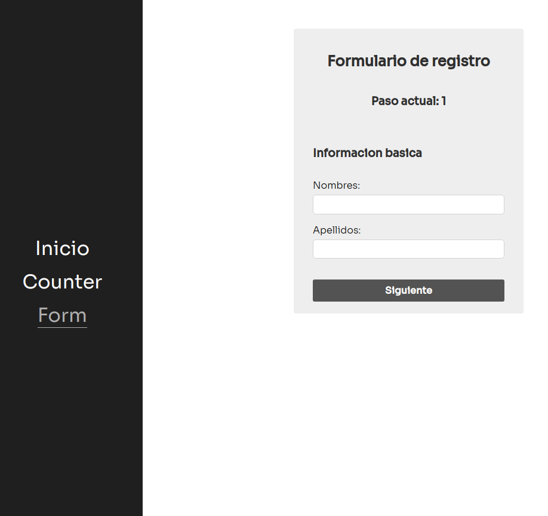

# Pagina web en React con componentes utilizando Redity y Sttore

Librerias:

- Sttore
- Redity
- React-router-dom
- StyledComponents



Para instalar aplicacion ejecutar:

```
npm install
```

Para iniciar aplicacion ejecutar

```
npm start
```

------

